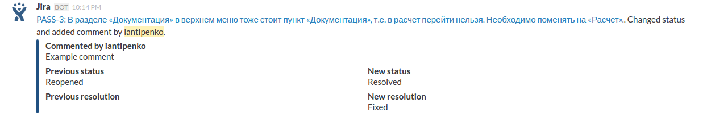

# Jira Slack integration

Configuring
-----------
* Run `composer install`
* Create `jira-slack/config/yml/projectToSlackWebHook.yml` based on `jira-slack/config/yml/projectToSlackWebHook.yml.dist` (Remove `test` integration)
* Create `jira-slack/config/yml/config.yml` based on `jira-slack/config/yml/config.yml.dist`. (`securityToken` is your own token for access to jira-slack integration admin.)

Usage
-----
* Create slack incoming webhook (on page `https://your-slack.slack.com/services/new/incoming-webhook`).
* Open `http://your-jira-slack-integration.dev/project/list/your-security-token`, where `your-security-token` token from `config.yml`, click `Add new` and fill `Project Name` (project custom name) and `Slack Webhook Url` from previous step.
* Create jira webkhook (on page `http://your-jira.dev/plugins/servlet/webhooks`), set URL like `http://your-jira-slack-integration.dev/send/event/project-name`, where `project-name` project name from previous step.
* Enjoy!

Example
-------

